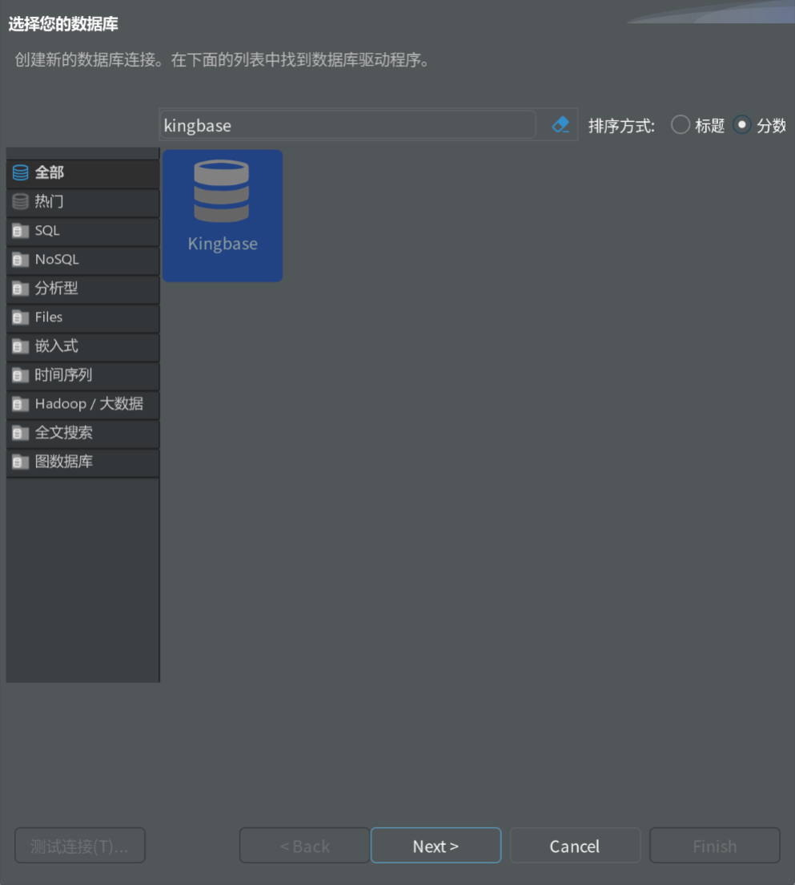
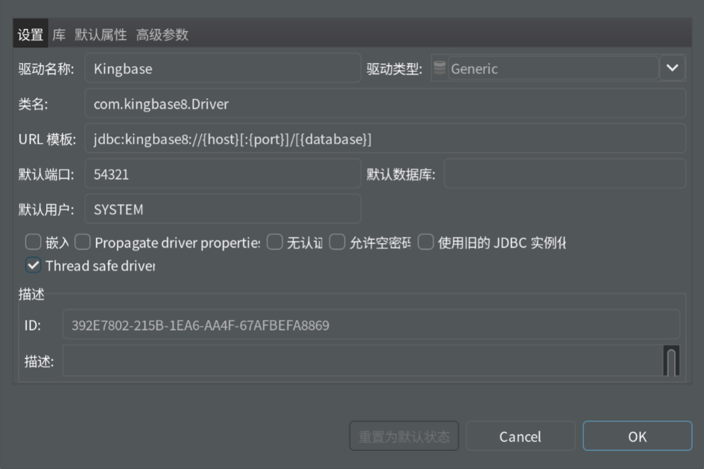
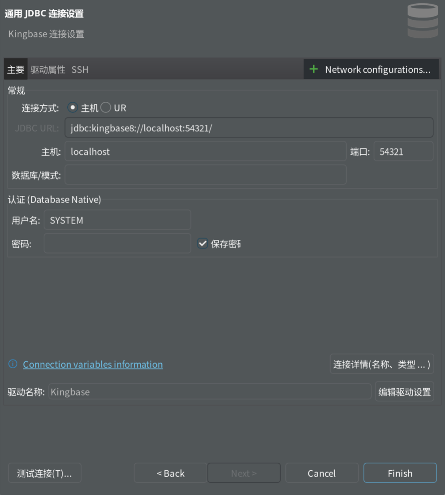

# 安装

官网下载docker镜像

使用docker加载镜像

```bash
docker load -i <镜像名称>.tar #命名规则一般为kdb_arch_hash.tar
```

创建文件夹并编写文件

docker-compose.yml

⚠️注意image一行中的hash要按照你的镜像修改

```yaml
version: '3'
services:
kingbase:
container_name: kingbase
image: kingbase_v009r001c002b0014_single_x86:v1
restart: always
# privileged: true # 超管权限
cap_add:
# 忽略资源限制ulimit
- CAP_SYS_RESOURCE                  # 不推荐privileged
environment:
- "TZ=Asia/Shanghai"                # 改成国内时区
- "DB_USER=mytestname"              # 初始用户
- "DB_PASSWORD=mytestpwd@123.com"   # 初始密码
- "DB_MODE=mysql"                   # 数据库模式oracle/pg/mysql
- "NEED_START=yes"                  # yes(默认 启动数据库)/ no（不启动数据库）
- "ENABLE_CI=yes"                   # yes(默认 大小写不敏感)/no 大小写敏感
volumes:
- "./data:/home/kingbase/userdata/"
ports:
- "54321:54321"
healthcheck:
test: '/home/kingbase/install/kingbase/bin/ksql -Umytestname -d test -p54321 -c "SELECT get_license_validdays();"'
interval: 5s
timeout: 10s
retries: 40
```

运行容器

```bash
docker-compose up
```

license文件放在

```bash
./install/kingbase/bin #install文件夹是容器内的一个文件夹
```

# 基础常用命令

```bash
### 进入容器：
docker exec -it kingbase /bin/bash
### 重新加载配置
/home/kingbase/install/kingbase/bin/sys_ctl reload -D  /home/kingbase/userdata/data/
### 查看数据库模式
cat /home/kingbase/userdata/data/initdb.conf 
### 登录数据库（容器内 不用密码）
ksql -Umytestname -d test -p54321 -c "\\d" ##使用kingbase的客户端连接
### 启动临时容器模拟外部需要密码的访问
docker run -it --rm --entrypoint ksql --network host kingbase_v008r006c008b0014_single_x86:v1 --version
# --entrypoint ksql ： 覆盖入口
docker run -it --rm --entrypoint ksql --network host kingbase_v008r006c008b0014_single_x86:v1 \\
-h localhost -p 54321 -d test --username mytestname --password -c "\\d"
# 查看lisence过期时间
docker run -it --rm --entrypoint ksql --network host kingbase_v008r006c008b0014_single_x86:v1 \\
-h localhost -p 54321 -d test --username mytestname --password -c "SELECT get_license_validdays();"
# 查看lisence基础信息
docker run -it --rm --entrypoint ksql --network host kingbase_v008r006c008b0014_single_x86:v1 \\
-h localhost -p 54321 -d test --username mytestname --password -c "select get_license_info();"
# 还原备份的sql
ksql -U mytestname -d test -p 54321 -f all_kingbase_db.sql
```

# 使用DBeaver连接

一、新建驱动管理器

二、填写驱动信息


三、设置库（驱动下载）

驱动添加：事先下载好的驱动文件，添加文件即可。

四、新建数据库连接
填写数据库连接配置信息
测试连接


$$

$$